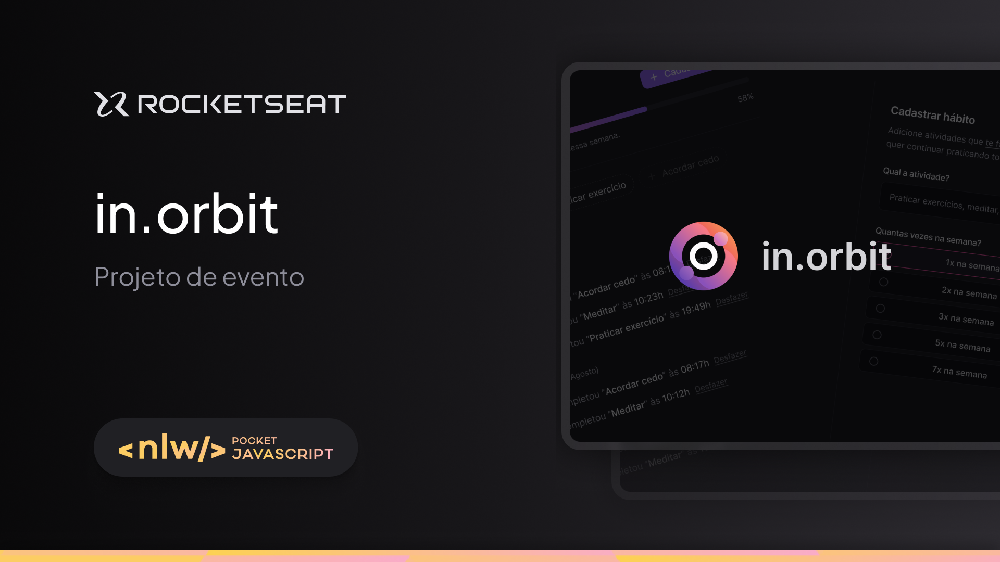
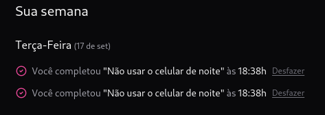

<div align="center">
    
</div>


O Next Level Week(NLW) é um evento semanal onde a Rocketseat disponibiliza um projeto para realizar junto a sua comunidade. Nessa edição, a "Pocket", foi realizado um projeto para se tornar um Desenvolvedor Fullstack e para isso foi feito um projeto completo, desde o desenvolvimento do Backend ao Frontend, dando o nome ao projeto de in.orbit. Um aplicativo para gerir seus objetivos, onde o usuário pode criar uma meta e definir quantas vezes na seman vai realizá-la, ou seja, um controle de objetivos/metas.


---
## :art: Layout
[Figma](https://www.figma.com/community/file/1415093862269754302/nlw-pocket-js-in-orbit)

---
## :file_folder: Techs
- [Example](https://nextjs.org/)
---
## :book: Features adicionais

##### - Ação de desfazer a conclusão de um objetivo
<p>No Backend: Desenvolvimento da rota para fazer a mudança no banco de dados para excluir a ação de conclusão</p>  
<p>No Frontend: Criação da requisição/fetch dos dados, usando uma rota de DELETE para refazer a ação de completion/conclusão de meta</p>
<div align="center">
    
</div>

---


## :receipt: Environment variables

- É necessário criar o banco de dados PostgreSQL para rodar o Backend, você tem a opção de usar o Docker, seguindo o passo a passo abaixo:
- 1º Entre na pasta server
- 2º Rode o comando abaixo, para criar o container

```
    docker compose up -d
```
- 3º Copie o endereço do container e cole na variável ambiente abaixo
```
DATABASE_URL=
```

- 4º Caso não queira usar o Docker, basta criar o banco em algum serviço online, copiar e colar o seu endereço na variável

---

## :desktop_computer: Como rodar

- 1º Abra a pasta Backend e Frontend, em duas abas do terminal e rode o comando abaixo:

```
pnpm run dev
```

---
<h2 id="colab">🤝 Colaboradores</h2>
 <tr>
    <td align="center">
      <a href="https://github.com/lucasgomesgp">
        <br>
        <sub>
          <b>Lucas Gomes</b>
        </sub>
      </a>
    </td>
  </tr>
</table>

---
## :spiral_notepad: License
Arquivos sob a licença [MIT](https://github.com/lucasgomesgp) criado por Lucas Gomes.
